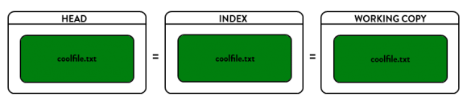
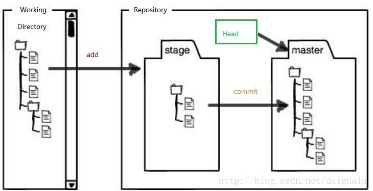

# Git
### 一、Git 体验

1、初始化本地git

    git init

2、配置用户名

    git config --global user.name "<your nickName>"

3、配置邮箱

    git config --global user.email "<your email address>"

4、查看仓库状态

    git status

Tips：支持中文文件名

    git config --global core.quotepath false

5、提交本地仓库

    git add .
    git commit -m"【Git】[Git 常用操作及原理]"

6、关联远程仓库

    git remote add origin <your git repository address>

7、保持Github 同步

    git pull

  Tips 1：
  There is no tracking information for the current branch.
  Please specify which branch you want to merge with.
  See git-pull(1) for details.

    git pull <remote> <branch>

  If you wish to set tracking information for this branch you can do so with:

    git branch --set-upstream-to=origin/<branch> master

  解决方式：

    git branch --set-upstream-to=origin/master master

  Tips 2：
    refusing to merge unrelated histories

  解决方式：

    git pull --allow-unrelated-histories

8、推送到远程仓库

    git push -u origin master

  Tips：记得添加公钥，增加写权限

#### * 先从GitHub上初始化仓库，再clone到本地不会这么麻烦，clone下来之后配置下用户名和邮箱就可以用了

### 二、常用操作

####1、分支

1.1签出

    git checkout <branchName>

1.2切换

    git checkout <branchName>

1.3创建分支

    git branch <branchName>

1.4合并分支  

    git merge <branchName> 
    git merge --no-ff -m <branchName> 禁用快速合并（Fast-forward）

1.5删除本地分支

    git branch -d <branchName>

####2、远程

2.1 查看远程分支信息

    git remote -vv 

2.2 删除远程分支

    git push origin --delete <branchName>

2.3 推送本地分支到远程，远程没有的话会自动创建

    git push origin develop:develop

2.4 新建分支，并删除、推送到 远程仓库：

    git checkout -b 1.6.0
    git push origin -d release/1.6.0
    git push origin 1.6.0:release/1.6.0

####3、tag

Git 主要使用两种类型的标签：轻量标签（lightweight）与附注标签（annotated）。

3.1 轻量标签:

>一个轻量标签很像一个不会改变的分支 - 它只是一个特定提交的引用。（这点与svn不同svn的标签是会移动的）

3.2 附注标签:

>是存储在 Git 数据库中的一个完整对象。 它们是可以被校验的；其中包含打标签者的名字、电子邮件地址、日期时间；还有一个标签信息；并且可以使用 GNU Privacy Guard （GPG）签名与验证。 通常建议创建附注标签，这样你可以拥有以上所有信息；但是如果你只是想用一个临时的标签，或者因为某些原因不想要保存那些信息，轻量标签也是可用的

3.3 [具体用法](./Git-tag.md)

####4、版本操作

>4.1 撤销（git push 前）

4.1.1 git add 之前

    git checkout -- filename来撤销修改
    git checkout -- .

4.1.2 git add 后

    git reset HEAD 【filename】不加路劲则回撤全部
    git checkout fileName

4.1.3 git commit 后

    git reset [--hard|soft|mixed|merge|keep] [commit|HEAD]

  soft

   

  mixed

   

  hard

   

>4.2 回滚（git push 后）

4.2.1 打了tag的

    git checkout <tag>

4.2.2 回到当前HEAD

    git checkout <branch_name>

4.2.3 撤销指定文件到指定版本

    git checkout <commitID> <filename>

4.2.4 删除最后一次远程提交

方式一：使用revert

    git revert HEAD 
    git push origin master

方式二：使用reset
    
    git reset --hard HEAD^ 
    git push origin master -f

* 二者区别：

>revert是放弃指定提交的修改，但是会生成一次新的提交，需要填写提交注释，以前的历史记录都在；
reset是指将HEAD指针指到指定提交，历史记录中不会出现放弃的提交记录。

4.2.5 回滚某次提交

    git revert commitID

4.2.6 删除某次提交

    git rebase -i "5b3ba7a"^

####5、显示差异

	git diff

5.1 比较工作区与暂存区

    git diff 不加参数即默认比较工作区与暂存区

5.2 比较暂存区与最新本地版本库（本地库中最近一次commit的内容）

    git diff --cached  [<path>...]

5.3 比较工作区与最新本地版本库

    git diff HEAD [<path>...]  如果HEAD指向的是master分支，那么HEAD还可以换成master

5.4 比较工作区与指定commit-id的差异

    git diff commit-id  [<path>...]

5.5 比较暂存区与指定commit-id的差异

    git diff --cached [<commit-id>] [<path>...]

5.6 比较两个commit-id之间的差异

    git diff [<commit-id>] [<commit-id>]

5.7 使用git diff打补丁

    git diff > patch  
    
patch的命名是随意的，不加其他参数时作用是当我们希望将我们本仓库工作区的修改拷贝一份到其他机器上使用，但是修改的文件比较多，拷贝量比较大，此时我们可以将修改的代码做成补丁，之后在其他机器上对应目录下使用 git apply patch 将补丁打上即可.

    git diff --cached > patch 是将我们暂存区与版本库的差异做成补丁

    git diff --HEAD > patch 是将工作区与版本库的差异做成补丁

    git diff Testfile > patch 将单个文件做成一个单独的补丁

拓展：git apply patch 应用补丁，应用补丁之前我们可以先检验一下补丁能否应用，git apply --check patch 如果没有任何输出，那么表示可以顺利接受这个补丁

另外可以使用git apply --reject patch将能打的补丁先打上，有冲突的会生成.rej文件，此时可以找到这些文件进行手动打补丁　

####6、日志

	git log -n

####7、查看仓库状态

	git status

####8、提交
  提交到本地代码库，一般分两步：

  * 第一步

    	git add .

  * 第二步

    	git commit -m""
    	git commit --amend

####9、从远程仓库更新

  9.1 拉取
    
      git fetch
  * 更新git remote 中所有的远程仓库所包含分支的最新commit-id, 将其记录到.git/FETCH_HEAD文件中

9.2 拉取并自动合并

    git pull
  * 相当于 git fetch和git merge

####10、推送本地提交到远程仓库

	git push

####11、文件夹 (release)

    git checkout -b 1.6.0
    git push origin -d release/1.6.0
    git push origin 1.6.0:release/1.6.0

### 三、原理

####1、暂存区

　　理解Git的暂存区（stage 或 index）如下图所示，左侧是工作区（working directory），右侧是版本库（Repository），每次add某个文件时，就会存放在版本库的stage，commit后才真正的提交到本地的版本库中，默认git init时，会创建一个master分支，以及一个指向master的指针Head。

### 四、Gitlab 服务器的搭建
